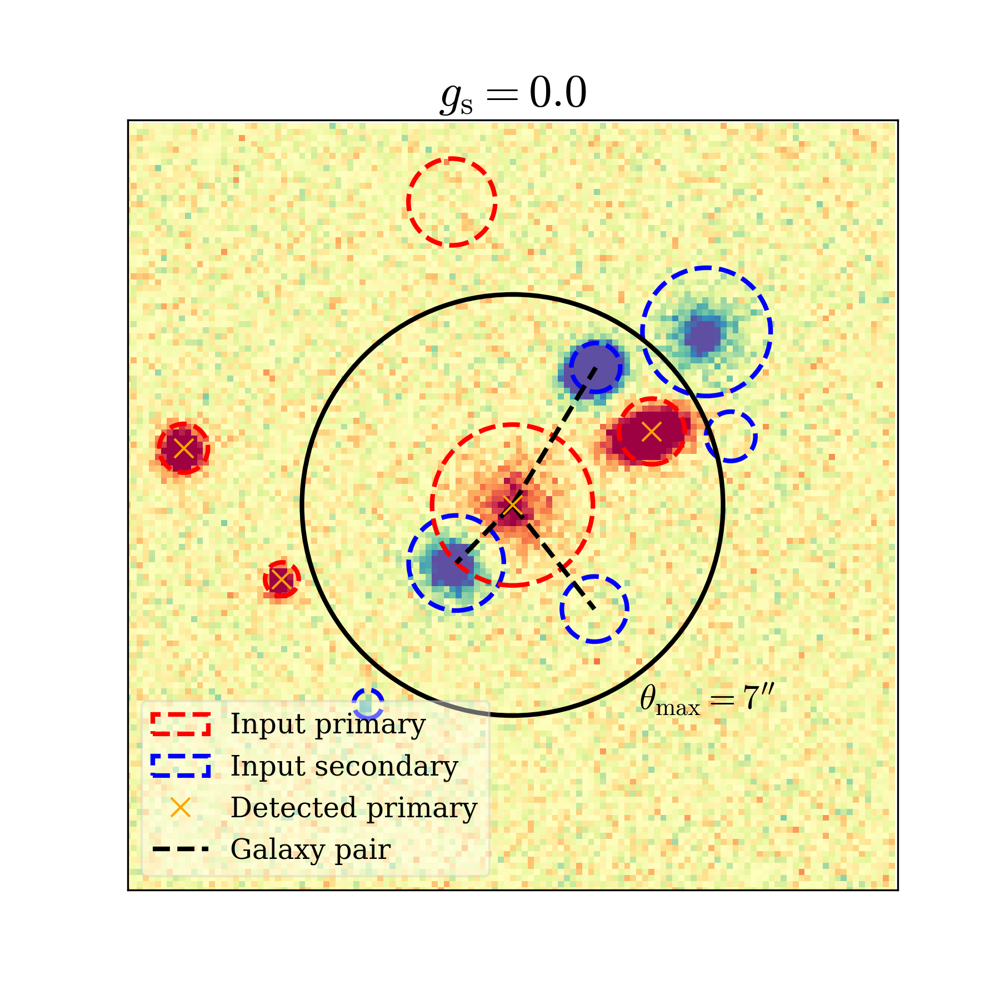
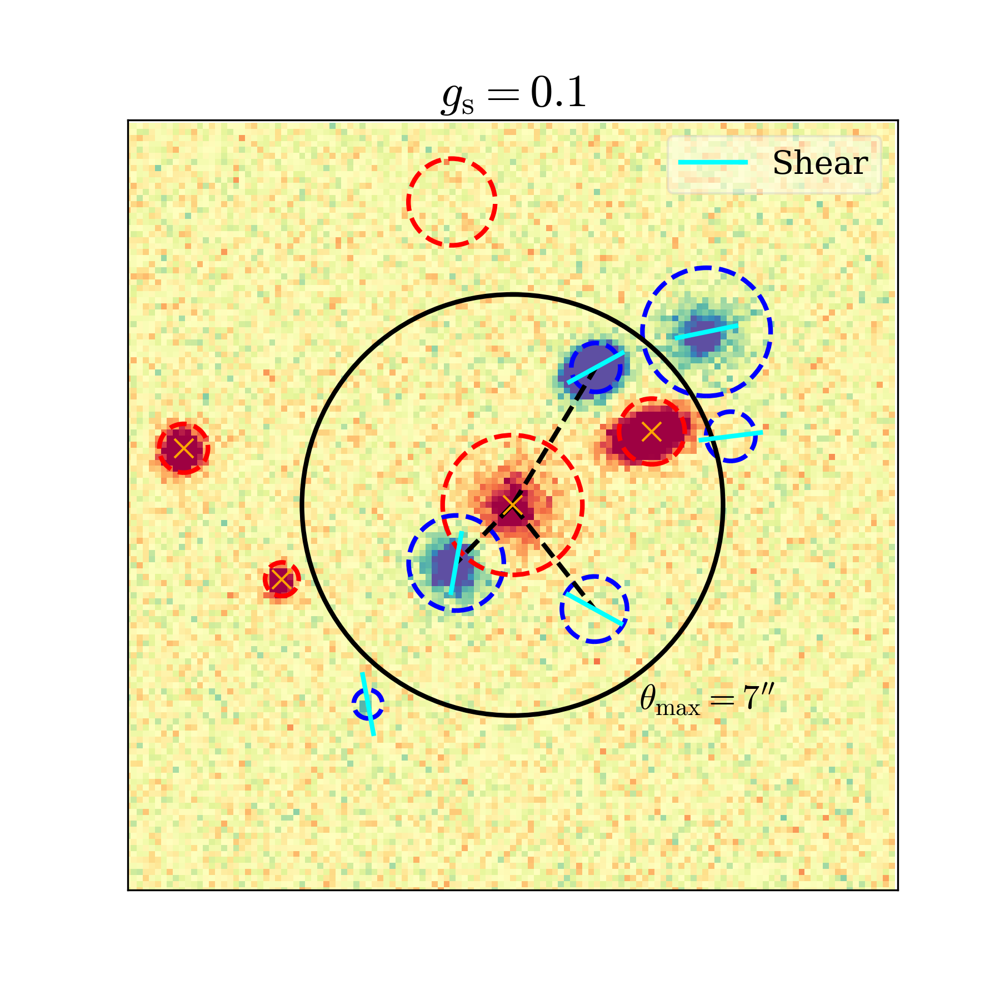

```text
                ██████╗ ██╗     ███████╗███╗   ██╗██████╗ ███████╗███╗   ███╗██╗   ██╗
                ██╔══██╗██║     ██╔════╝████╗  ██║██╔══██╗██╔════╝████╗ ████║██║   ██║
                ██████╔╝██║     █████╗  ██╔██╗ ██║██║  ██║█████╗  ██╔████╔██║██║   ██║
                ██╔══██╗██║     ██╔══╝  ██║╚██╗██║██║  ██║██╔══╝  ██║╚██╔╝██║██║   ██║
                ██████╔╝███████╗███████╗██║ ╚████║██████╔╝███████╗██║ ╚═╝ ██║╚██████╔╝
                ╚═════╝ ╚══════╝╚══════╝╚═╝  ╚═══╝╚═════╝ ╚══════╝╚═╝     ╚═╝ ╚═════╝
```

---

End-to-end weak lensing blending pipeline: **simulate → measure → train emulators → inference**.

Paper: [Zhang et al. 2025, arXiv:2507.19130](https://arxiv.org/pdf/2507.19130)

<p align="center">
  
  &nbsp;
  
</p>
<p align="center"><i>The same simulated field at <code>g<sub>s</sub> = 0.0</code> (left) and <code>g<sub>s</sub> = 0.1</code> (right). Dashed red/blue circles mark input primaries/secondaries inside the matching radius θ<sub>max</sub>; cyan ticks in the right panel show shear measured at the primary positions — the response signal that the emulator learns.</i></p>

## Pipeline overview

| Step | Script / notebook | Description |
|------|------------------|-------------|
| 1 | `run_pipeline.py --steps 1` | Generate galaxy catalogues + sim configs from a base catalogue (FS2 / galsbi) |
| 2 | `run_pipeline.py --steps 2` | Run MultiBand_ImSim image simulation + SExtractor detection (MPI) |
| 3 | `run_pipeline.py --steps 3` | Shape measurement with ngmix at detected primary positions (MPI) |
| 3b | `run_pipeline.py --steps 3b` | Shape measurement for **secondaries** (self-response targets) |
| 4 | `run_pipeline.py --steps 4` | Build blending-response + detection catalogues |
| 4b | `run_pipeline.py --steps 4b` | Build **self-response** catalogue |
| 5 | `train_emulator.py --mode {tune,train}` | Optuna hyperparameter tuning + XGBoost training |
| **6** | **`run_inference.py`** | **Apply trained emulators to an input catalogue** |

## Shear Coordinate Convention

Blendemu uses the usual sky spin-2 convention for generated shear and
ellipticity-like components:

```text
(q1, q2) = q * (cos 2 theta, sin 2 theta)
```

Generated catalogues carry `shear_component_convention = "sky_cos_sin"`.


## Setup

Clone the repo and put it on your `PYTHONPATH`:

```bash
git clone https://github.com/<your-org>/blendemu.git
cd blendemu
export PYTHONPATH="$PWD:$PYTHONPATH"
```

Copy the example config and fill in paths for your environment:

```bash
cp configs/fs2_lsst_r.example.yaml configs/fs2_lsst_r.yaml
# edit configs/fs2_lsst_r.yaml to point at your data / output directories
```

The MultiBand_ImSim base config is kept in `configs/base_sim_config.ini`;
the example YAMLs reference it relative to the YAML file.

If you intend to run the image-simulation steps, also point at your local
clone of MultiBand_ImSim:

```bash
export BLENDEMU_SIM_RUN=/path/to/MultiBand_ImSim/modules/Run.py
```

## Quick inference example

```python
from blendemu import BlendingPredictor
import pandas as pd
import numpy as np

predictor = BlendingPredictor.load(
    './models',
    conditions={'pixel_size': 0.2, 'zero_point': 30,
                'psf_fwhm': 0.73, 'moffat_beta': 2.224, 'pixel_rms': 0.312},
)

icat = pd.read_feather('data/example_catalog.feather')

z = np.linspace(0, 2, 201)
dndz = np.exp(-(z - 0.7)**2 / (2 * 0.1**2))
dndz /= dndz.sum() * (z[1] - z[0])

_, z, delta_n = predictor.correct_nz(icat, (dndz, z))
print(f'<z> shift: {np.trapz(delta_n * z, z):+.4f}')
```

## Full pipeline via CLI

```bash
# End-to-end for 200 cases
python scripts/run_pipeline.py --config configs/fs2_lsst_r.yaml --steps 1-5

# Self-response branch only
python scripts/run_pipeline.py --config configs/fs2_lsst_r.yaml --steps 3b,4b
python scripts/train_emulator.py --config configs/fs2_lsst_r.yaml --mode tune --task self_response

# Apply emulators to correct an n(z)
python scripts/run_inference.py \
    --config configs/fs2_lsst_r.yaml \
    --catalogue data/example_catalog.feather \
    --nz-file hsc_nz.fits \
    --output corrected_nz.fits
```

For detection/classification training, make sure
`training.classification_cuts[1][1]` reaches the faint limit of the catalogue
you will run inference on (`catalog.mag_cut`). XGBoost does not extrapolate a
survey-depth rolloff beyond the magnitude range it saw during training.

Training writes `models/emulator_metadata_<tag>.json`, which keeps the task
model filenames, feature boundaries, y-standardization, training parameters,
and summary metrics in one sidecar file. New training runs no longer emit the
old boundary/standardization `.npy` sidecars; `BlendingPredictor.load()` only
keeps `.npy` fallback support for older external model directories.

## Dependencies

- Python 3.9+, numpy, pandas, scipy, astropy
- galsim, ngmix (shape measurement)
- mpi4py (parallel simulation + shape measurement)
- xgboost, optuna, scikit-learn (emulator training)
- joblib, tqdm (parallel catalogue assembly)
- cosmic_toolbox (for galsbi catalogue loading)
